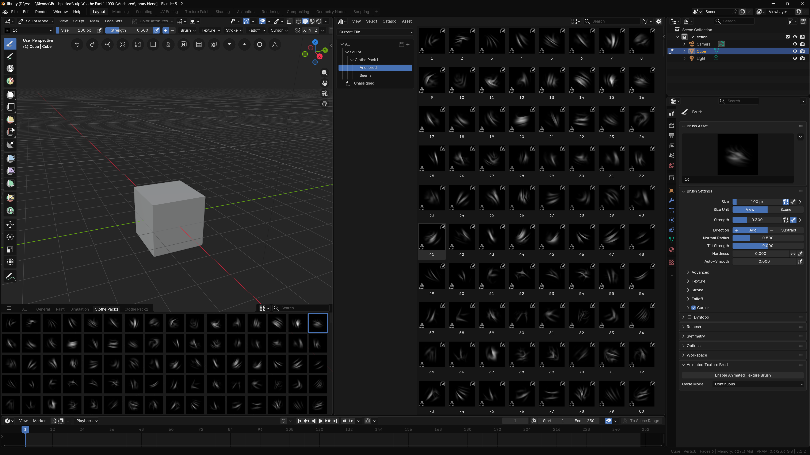

# Blender-Batch-Add-Textures-To-Sculpt-Brushes
A simple Python script to batch-apply Texture Masks to Sculpt Brushes and mark them as Asset.

  

I found many cheap brushpacks for Zbrush, and I wanted to use them with Blender, though adding them one by one to Blender is a long repetitive process. so this script automated it.

How To Use:
1. Create a .blend file.
2. Create a folder named Masks next to the .blend file.
3. Add the textures jpg/png/tiff/etc... to Masks folder.
4. Open the .blend file
5. Go to the Scripting tab.
6. Click New.
7. Copy and paste the script from Script.txt.
8. Click Run Script.
- Or Download the Template.zip, which has everything setup with few masks as examples.

The .blend file will populate with sculpt brushes. Save the file, in the Preferences, select the .blend file path as an Asset Library. Make sure the Masks folder is always with the .blend file because it uses relative path for the textures.

By default the created brushes are using "Anchored" method, modify the script to change how the brushes should behave.

__Tested on Blender 5.1.2__

__ALWAYS BE CAUTIOUS RUNNING SCRIPTS MADE WITH CHATGPT!!__
